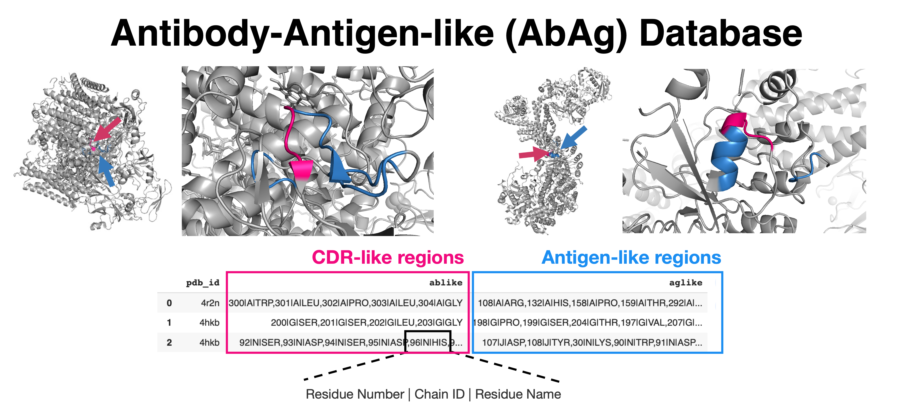

# ProjectAbDesign

## About
This project transforms a workflow to generate the Antibody-Antigen (AbAg) database in the antibody design framework developed by Aguilar Rangel et al. [cite](https://doi.org/10.1126/sciadv.abp9540) into an automated pipeline. AbAg database is a collection of antigen-like and CDR-like regions in all non-redundant general protein structures reported in the [PDB database](https://www.rcsb.org/docs/programmatic-access/file-download-services).


## Getting started

### Prerequisites

* Install [Conda](https://conda.io/projects/conda/en/latest/user-guide/install/index.html) with python 3.11

* Install [Master](https://grigoryanlab.org/master/): a rapid structural similarity search program

### Installation

1. Clone the repository
   ```sh
   git clone https://github.com/FahsaiNak/ProjectAbDesign.git
   ```

2. Create environment from environment.yml
   ```sh
   conda env create -f environment.yml
   ```
### Implementation 

### Utilizing Snake Make
   - Update the paths in your configuration file found in the run directory.
   - Update somePDB.csv in the datasets directory with your complete list of PDB structures of interest
     
   - To run the snakefile use the following command: `snakemake -c1`

## Methods

### Step 1: CDR fragment collection
   - Navigate to [SAbDab](https://opig.stats.ox.ac.uk/webapps/sabdab-sabpred/sabdab/search/?all=true#downloads)
   - Click on Downloads on the left hand side of the page
   - Click on Download an archived zip file to download structures
   - Once the zip file is downloaded, extract the chothia zip file and save it into the Datasets directory in the local repository
   - Change directory to the run directory
   - On the command line run:
     ```sh
      bash CDR_fragment_database.sh

### Step 2: Target protein collection and curation
   - Ensure you have enough free space for the PDB90 files of interest.
   - Add a CSV list of target PDB proteins to download in the Datasets directory. The list most have a similar format to the somePDB.csv file in the Datasets directory.
   - Once the sequence list has been added, modify the PDB90.sh script in the run folder. It currently has python ../src/PDB90.py --output_folder "../Datasets/all_PDB" --csv_file "../Datasets/somePDB.csv" written, change "../Datasets/somePDB.csv" with the location of the downloaded PDB csv file.
   - Move to the run directory and run the bash script with:
     ```sh
     bash PDB90.sh
     ```
   - The script might take a long time to run depending on the number of PDB files of interest that will be downloaded, uncompressed and cleaned.

### Step 3: CDR-like region identification
  - Remain in run directory
  - Run Prep_queries_AbAg.sh and Prep_targets_AbAg.sh to convert fragmented-CDRs (queries) and cleaned-PDB90 proteins (targets) in PDB to PDS that is readable for Master program.
    ```sh
    ./Prep_queries_AbAg.sh
    ./Prep_targets_AbAg.sh
    ```
  - Run Ablike.sh search for antigen(CDR)-like regions in every target proteins (PDB90 proteins)
    ```sh
    ./Ablike.sh
    ```
  - Run get_matchInfo.sh to collect antigen(CDR)-like structure information from the Master match files.
    ```sh
    ./get_matchInfo.sh
    ```

### Step 4: Antigen-like region identification and AbAg database generation
  - Remain in run directory
  - Run Aglike.sh to search for contacting/interacting residues of each antigen(CDR)-like region in the same protein. Then, all the antibody-antigen-like information from each PDB90 proteins is combined into a compressed file named AbAb.pkl
    ```sh
    ./Aglike.sh
    ```

### Step 5: AbAg tranformation 
  - Move to src directory, and run python process_AbAg.py with the following command (third argument optional):
    ```commandline
    python process_AbAg.py --abag_filename 'AbAg.pkl' --output_filename 'regions_for_vis.csv' --subset_csv_filename 'PDB_IDs_to_filter.csv'
    ```

## Structure visualization 
  - If desired, use the structure_visualization.ipynb notebook and the csv file generated by process_AgAg.py to visualize a protein of interest with Ab-like and Ag-like regions highlighted. 
  - Upload the notebook to Google Colab along with regions_for_vis.csv and vis_test_bad.csv from the test/Datasets/test_pkl_and_regions_for_vis and set the variables pdb_id and AbAg_pair_index.
  - Run each cell.
